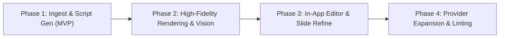

# 001 — Appendix: agent brainstorm reports (verbatim)

Supporting material for `001-auto-script-pipeline-proposal.md`. Three agents received the same brief; round 2 asked each to rebut the other two. Reports are reproduced unedited — they contain claims the synthesis corrected (see §2 and §5 of the proposal).

Agents: **Opus** = internal Claude Opus agent · **pi** = `pi --model openai-codex/gpt-5.6-sol:medium` · **agy** = `agy --model "Gemini 3.8 Flash (High)"`

---

## Brief (round 1)

# Brief — presenter-ai: automated "upload deck → analyse → propose script → present" pipeline

You are one of three independent agents asked to **propose and argue** an architecture. This is a
brainstorm/debate, not an implementation task. **Do not modify any project file, do not run tests,
do not start the server, and never open `.env`.** Read-only exploration of the project is expected.

Project (read-only): `D:\sources\demo\presenter-ai`
Read at least: `README.md`, `src/server/index.js`, `src/server/presenter.js`, `src/server/script-parser.js`,
`src/server/prompt.js`, `src/web/deck-driver.js`, `presentations/sample.md`, `docs/plan/001-ai-presenter-gpt-live-mvp.md`,
`docs/progress/001-work-log.md`, `docs/guides/001-presenting-a-new-deck.md`.

## Current system (facts, do not relitigate)

- Node 22, single process: Express + `ws`. No bundler, no framework on the client (plain ES modules + AudioWorklets).
- `Presenter` state machine drives GPT-Live-1 (OpenAI Live API, full duplex WebSocket). Narration is sent as
  `session.instructions.append` (≤500 tokens per append; the app chunks slides at ~1400 chars); `> notes:` go to
  `session.thinking.append`; a context file goes into the system instructions (≤ ~48k chars).
- Script format: `presentations/<id>.md` = YAML frontmatter (`title`, `deck`, `driver`, `context`, `voice`,
  `advanceSilenceMs`, `chunkChars`) + contiguous `## Slide N — Title` sections with narration paragraphs and
  optional `> notes:` blockquotes. Parser: `src/server/script-parser.js`.
- Decks are same-origin HTML under `decks/<name>/` loaded in an iframe and driven by adapters in
  `src/web/deck-driver.js`: `showFn` (global `show(n)` + `.slide` + `#slide-N` hash), `reveal`, `sections`.
  No PPTX/PDF support today. Slide advance = RMS-silence of the model's output audio for `advanceSilenceMs`.
- Upstream: Azure AI Foundry GPT-Live deployment (rate limit 10 RPM / 10k TPM) with OpenAI-direct fallback.
  Env names `UPSTREAM_*`, `FALLBACK_OPENAI_*`. Session cost ≈ $0.05/min.
- The manual path (write the script by hand) works and **must keep working**.

## The requested feature

"By the time the user uploads the slide deck, the app should automatically analyse it and propose the script,
then present. We will offer several large language models for the user to choose from to generate the script
professionally."

So: **upload → extract slides → user picks an LLM → LLM proposes the script (+ context file) in the existing
format → user reviews/edits → present.** End to end, inside this app.

### Inputs to handle

HTML decks (any framework, single-file or multi-file), **PPTX**, probably **PDF**. Extract per-slide text, tables,
speaker notes if present, and images (org charts, diagrams, screenshots → need a vision-capable model).

### Script generation

- User-selectable LLM ("professional script"): candidates are OpenAI GPT-5.x via the Responses API, Anthropic Claude
  (`claude-opus-5`, `claude-sonnet-5`), Azure-hosted models; BYO key per provider (env or settings UI).
- Vision for image-heavy slides; output the Markdown script + context file in the existing format; user edits
  before presenting (in-app editor or just a file on disk?).

### Deck driving for arbitrary HTML/PPTX — known options

(a) convert PPTX → HTML (LibreOffice headless, `pptx2html`-style libraries, or render each slide to an image and
wrap the images in the `show(n)` template); (b) inject a generic `show(n)` shim into unknown HTML decks;
(c) render slides to images server-side (Playwright/LibreOffice) and present an image deck.

## Debate points — take a position on EACH, with reasoning

1. Extraction fidelity vs cost (text-only parse vs vision on rendered slide images vs both).
2. Where LLM calls run: server (Node) vs browser (client-side keys) — security, CORS, streaming.
3. Streaming the script per slide so presenting can start before the whole script exists — worth it or not?
4. Caching / versioning of generated scripts (regenerate per slide? keep user edits when regenerating?).
5. How the user reviews/edits (in-app editor vs external editor + file watch vs both).
6. Rate limits (Azure 10 RPM) and cost control for generation.
7. Privacy of deck content (what leaves the machine, to which provider, opt-in).
8. PPTX conversion fidelity (which converter; fallback to images).
9. Evaluating script quality (how do we know the script is "professional"? rubric, self-critique pass, length/timing checks).
10. Keep it small: single Node process preferred; no new build toolchain unless justified; minimal new dependencies.

## Required output (write it to your report file as Markdown, immediately, then refine)

1. **Candidate architectures (2–3)** — each with: components, data flow (upload → present), new modules/files in
   this codebase, new dependencies, what changes in `presenter.js`/`index.js`/`deck-driver.js`, and rough effort.
2. **Positions on the 10 debate points** (numbered, one paragraph each, with a clear stance).
3. **Recommendation** — which architecture and why; what you would explicitly NOT build.
4. **Phased plan sketch** — 3–4 phases, each shippable, phase 1 being the smallest thing that demonstrates
   upload → generated script → present.
5. **Risks / open questions.**

Be concrete (name libraries, APIs, file paths), be opinionated, and keep it under ~1500 words.
End the file with the exact line: `<!-- REPORT COMPLETE -->`

---

## Round-2 instructions

# Round 2 — rebuttal

Read the other two agents' round-1 reports (same folder as this file):

- `r1-opus.md` — internal agent (Claude Opus)
- `r1-pi.md` — external agent `pi` (GPT-5.6 sol)
- `r1-agy.md` — external agent `agy` (Gemini 3.8 Flash)

All three of you agreed on: server-side LLM calls; text-first extraction with selective vision; do not present
while generating; files as the store, no DB; per-slide regenerate that never overwrites user edits; LibreOffice
→ PDF → images as the PPTX fidelity path; deterministic lint (≤1400 chars, count match, numbers grounded).
**Do not re-argue those.** Argue the splits:

1. **Presenting HTML decks:** keep the native HTML driveable (Opus: inject a `show(n)` shim into *our copy* when
   no adapter matches) vs render *everything* to an image deck (agy Arch 1) vs no shim injection at all in v1 (pi).
2. **PDF rendering:** in-browser pdf.js `show(n)` template, no server rasterisation (Opus) vs server-side PNGs via
   `pdftoppm` / `@napi-rs/canvas` (agy, pi). Consider Windows-without-Poppler, native deps, and the vision input
   (does the LLM get PDF natively, images, or text?).
3. **HTTP/provider layer:** official SDKs `@anthropic-ai/sdk` + `openai` (Opus) vs native `fetch` only (pi, agy).
   Structured output, streaming, retries, Azure variants — which is less code and less breakage over a year?
4. **Upload + PPTX parsing:** `express.raw` + `fflate` + `fast-xml-parser` (Opus) vs `busboy` + `jszip` (agy, pi).
5. **HTML safety:** Opus parses with `linkedom` (no script execution); pi wants sandboxed headless Chromium with
   network off. Is running the user's own local deck's JS in the extractor actually a risk worth code?
6. **Quality pass:** opt-in same-model "Polish" self-critique (Opus) vs optional *different*-model critique with
   diff (pi) vs no LLM judge at all, lint + good prompt only (agy).
7. **Editing loop:** `fs.watch` → `/ws` push (Opus, agy) vs explicit Reload, no watcher (pi).
8. **Generation call shape:** one request per ≤20-slide deck (Opus) vs two-stage outline + batched narration (agy)
   vs queue with provider concurrency (pi). Which gives the best cross-slide coherence per dollar and survives
   a 10 RPM limit?
9. **Effort:** agy says 3.5 days, Opus 5–7 days, pi 4–6 engineer-weeks for the same thing. Reconcile: what is the
   *honest* estimate for a working phase 1 (upload HTML → generated script → present) and for the full thing?
10. **Phase-1 input format:** HTML first (Opus, demo = the Ricoh deck), PDF first (pi), PPTX+HTML first (agy).

## Write to your round-2 report file (≤ 900 words)

- **Rebuttals**: for each of the 10 splits, one short paragraph: your final position, and the strongest argument
  against the other side(s). Name who you are disagreeing with. It is fine — encouraged — to concede.
- **Changed my mind**: list what you now believe differently after reading the others, and why.
- **Consensus phase 1**: the smallest scope you would sign off on, as a bullet list of concrete deliverables.
- **One thing the others missed**: a risk or requirement none of the three reports covered.

Still read-only, no project edits, no tests, no server, never `.env`.
End the file with the exact line: `<!-- REPORT COMPLETE -->`

---

## Round 1 — Opus (`r1-opus.md`)

# r1 — Internal agent (Opus): upload → analyse → propose script → present

Ground truth I build on (read-only pass over the repo): `index.js` already has `/api/presentations`, static `/decks`, a 1-client `/ws`; `Presenter.start(id)` hot-reads `presentations/<id>.md` on every Start; `script-parser.js` is line-based and strict (contiguous `## Slide N`); `deck-driver.js` drives `showFn | reveal | sections`; `scripts/browser-e2e.mjs` already spawns Edge/Chrome over raw CDP with `ws` (no Playwright); deps are four pure-JS packages; tests are `node --test`. The Ricoh deck is 535 KB single-file HTML with two `data:image/png` (an org chart) — the exact "needs vision" case.

## 1. Candidate architectures

### A — Server pipeline, files as the database, text-first + targeted vision (recommended)

**Flow:** `PUT /api/decks/:name` (raw body via `express.raw({limit:'300mb'})`, zero upload deps; zip → `fflate` unzip into `decks/<name>/`) → `extractDeck()` → cached `decks/<name>/.extract.json` → user picks provider/model → `POST /api/generate` streams SSE progress → `script-writer.js` writes `presentations/<name>.md` + `<name>-context.md` → existing flow (Start).

**New modules:**
- `src/server/extract/html.js` — `linkedom` DOM; slide split with the *same selectors* as `deck-driver.js` (`.slide`, `.slides > section`, `section.slide`); per slide: headings/lists/table → Markdown, `> notes` from `<aside class="notes">` (reveal), images = `` data-URIs or same-folder files → image blocks. No browser.
- `src/server/extract/pptx.js` — `fflate` + `fast-xml-parser`: order from `ppt/presentation.xml` `sldIdLst`, `<a:t>` runs grouped per shape, `<a:tbl>` → Markdown, `notesSlideN.xml` → notes, `slideN.xml.rels` → `ppt/media/*.png|jpg`. Exact text, free.
- `src/server/extract/pdf.js` — pass the PDF to the model natively (Claude `document` block, ≤100 pages; OpenAI Responses `input_file`); local text via `pdfjs-dist` `getTextContent()` for lint/count.
- `src/server/extract/html-render.js` (phase 4) — per-slide `Page.captureScreenshot` using the CDP spawn pattern from `browser-e2e.mjs`.
- `src/server/llm/{index,anthropic,openai}.js` — `@anthropic-ai/sdk` (`claude-opus-5` default, `claude-sonnet-5`; `AnthropicFoundry` for Azure-hosted Claude) and `openai` (Responses API, `gpt-5.x`; Azure OpenAI = same SDK with `baseURL .../openai/v1` + `api-key`). Structured JSON `{title, slides:[{number,title,narration,notes}], context}` via `output_config.format` / `text.format: json_schema`, streamed.
- `src/server/gen-prompt.js` — rubric + hard constraints (≤1400 chars, spoken register, no bullets, expand acronyms once, transitions), deck outline, per-slide content blocks; `cache_control` on the deck content so regenerate/critique hit cache.
- `src/server/script-writer.js` — `formatPresentation()` (inverse of `parsePresentation`, round-trip tested), `replaceSlide(md, n, slide)`, `lint(slides, extract)`.
- `decks/_template/pdf-deck.html` + vendored `src/web/vendor/pdfjs/` — renders `deck.pdf` page N into `.slide` divs and exposes `show(n)` + `#slide-N`, so the existing `showFn` adapter drives PPTX/PDF decks with **no change to `deck-driver.js`**.
- Routes: `PUT /api/decks/:name`, `POST /api/decks/:name/extract`, `POST /api/generate` (SSE), `GET /api/providers` (configured providers, never keys), `PUT /api/presentations/:id`, `POST /api/presentations/:id/slides/:n/regenerate`.
- Web: `src/web/generate.js` (upload → pick → progress `<dialog>`), `src/web/editor.js` (per-slide textareas); `app.js` handles a new `/ws` push `{type:'presentations'}` from `fs.watch`.

**Unchanged:** `presenter.js`, `prompt.js`, `deck-driver.js`, `script-parser.js`. **Deps:** `@anthropic-ai/sdk`, `openai`, `fflate`, `fast-xml-parser`, `linkedom`; optional external LibreOffice (`SOFFICE_PATH`). **Effort:** 5–7 dev-days across phases.

### B — Render-everything-to-images

Every input → per-slide PNG (HTML via CDP screenshots; PPTX via `soffice → pdf → pdftoppm`); the LLM sees only images (+ PPTX notes); present an ``-per-slide deck. One code path, perfect "what you see", any framework. But: vision misreads figures ("9 members" → "8"), the real HTML deck's interactivity is lost, no exact text for fact lint, native raster deps. ~3–4 days. **Verdict:** keep as the per-slide fallback inside A, not the spine.

### C — Agentic sidecar

Spawn `claude -p` / Claude Agent SDK `query()` (or Managed Agents + the `pptx` Agent Skill) with "read `decks/<name>`, write `presentations/<name>.md` in this format, verify with `parsePresentation`". Near-zero code, handles anything via code execution. But: one vendor (contradicts "several LLMs"), opaque cost/latency, no per-slide regenerate, progress not streamable into the UI, deck bytes go to a sandbox. **Verdict:** how the Ricoh script was drafted by hand; fine for a one-off, wrong as the product path.

## 2. Positions on the debate points

1. **Fidelity vs cost — text-first, vision targeted.** Extract text/tables/notes locally (exact, free); attach images only for slides that have them; full-slide screenshots only when a slide has <~40 chars of text. Cost is not the constraint (15 slides + 10 images ≈ 40k in / 6k out ≈ $0.35 on `claude-opus-5`, ≈ $0.14 on `claude-sonnet-5`, vs $3/h of live session); **accuracy** is — a professional script must quote the slide's numbers exactly, and only text gives a fact-coverage lint.
2. **Where LLM calls run — server, always.** OpenAI forbids browser keys, Anthropic needs a "dangerous" header, PPTX unzip and LibreOffice are server-side anyway, and the server owns the files. Stream progress over a dedicated SSE endpoint, not the session-scoped, single-client `/ws`.
3. **Streaming per slide — for progress, not for pipelining.** Show slides filling the editor as JSON items / `## Slide N` boundaries arrive. Do **not** start GPT-Live before the script exists: `session.start` needs the outline in immutable `instructions`, the user must review before speaking it in front of people, and a whole-deck generation (~40–90 s) is shorter than putting on headphones. Not worth the complexity.
4. **Caching/versioning — files, no DB.** Extraction cached by content hash; drafts in `presentations/.drafts/<id>/<ISO>-<provider>-<model>.md`; canonical `presentations/<id>.md` written once if absent, then only by explicit action. Per-slide regenerate replaces one section (`replaceSlide`) with neighbours as context. Slides whose narration differs from the last draft are "edited" and skipped by Regenerate-all unless overridden.
5. **Review/edit — both, cheaply.** Disk file stays canonical (already hot-read on Start). In-app: per-slide textarea + char counter (red >1400) + notes + Regenerate + Save. External editor: `fs.watch('presentations')` → `/ws` push → UI refresh. No CodeMirror/Monaco.
6. **Rate limits/cost.** Azure 10 RPM / 10k TPM is the *GPT-Live* deployment; one deck request alone exceeds 10k TPM, so generation **never** routes through it — separate `GEN_ANTHROPIC_KEY`, `GEN_OPENAI_KEY`, `GEN_AZURE_OPENAI_{ENDPOINT,KEY,DEPLOYMENT}`. One request per ≤20-slide deck (windows of 10 with overlap beyond); pre-flight token/cost panel (`countTokens` for Anthropic, heuristic for OpenAI); images downscaled ≤1024 px, icons <64 px dropped; `GEN_MAX_INPUT_TOKENS` cap; SDK `maxRetries` for 429; one in-flight generation at a time.
7. **Privacy.** Nothing leaves at upload; extraction is local. Before generation, a confirmation panel lists provider, model, endpoint host, slide/image counts and bytes; toggles `images: off`, `notes: off`. Content goes to exactly one provider. Keys env-only in phase 1; a settings UI later must write a gitignored file, never the browser. State vendors' no-training-by-default as their claim, not ours.
8. **PPTX — don't convert to HTML.** OOXML gives exact text/notes/tables/images. Visual fidelity: `soffice --headless --convert-to pdf` when present, else ask for PowerPoint's own PDF export (the most faithful renderer); present it through the pdf.js `show(n)` template. `pptx2html`-style libraries: rejected (layout breakage, unmaintained). An image deck is the same template, so the fallback is free.
9. **Quality — three layers.** (1) Deterministic lint in `script-writer.js`: count match, 300–1400 chars, no Markdown/bullets, no "slide N" phrases, every number on the slide appears in narration or notes, notes non-empty for table slides, hook on slide 1 / CTA on the last. (2) Rubric in `gen-prompt.js` + opt-in "Polish" self-critique pass (same model, per-slide scores + rewrites; opt-in because it doubles cost). (3) Measured: extend `scripts/headless-run.mjs` to print spoken seconds per slide vs the ~15 chars/s estimate — the only ground truth for timing.
10. **Keep it small — yes.** Single process, no bundler, five pure-JS deps, two vendored pdf.js files, no Playwright (reuse the CDP spawn), no multer, no DB/queue. LibreOffice optional.

## 3. Recommendation

**Build A.** It reuses every seam that exists (`showFn` adapter, `parsePresentation`, hot-reload on Start, the `/ws` bridge, CDP spawn), keeps the manual path byte-identical, and turns "professional" into checkable properties. Explicitly **not** building: PPTX→HTML conversion, browser-side LLM calls, a database, presenting-while-generating, a rich editor, a job queue, Playwright, voice navigation.

## 4. Phased plan

1. **Upload HTML → script → present (2 days).** `PUT /api/decks/:name` (single HTML), `extract/html.js`, `llm/anthropic.js` + `llm/openai.js`, `gen-prompt.js`, `script-writer.js` + lint, `POST /api/generate` SSE, minimal dialog. Demo: upload the Ricoh deck, script in ~60 s, press Start. Tests: extraction against `decks/ricoh`, writer round-trip, lint, mocked providers.
2. **Review loop (1–2 days).** Per-slide editor, save, regenerate slide, drafts folder, edited-slide protection, `fs.watch` push, provider/model picker via `/api/providers`, pre-flight cost panel.
3. **PPTX + PDF (2 days).** `extract/pptx.js`, `soffice` conversion, pdf.js deck template, PDF as native vision input, zip upload for multi-file HTML decks.
4. **Fidelity extras (1–2 days, optional).** CDP screenshots for text-poor HTML slides, "Polish" pass, headless timing report, settings UI for keys.

## 5. Risks / open questions

- Unknown HTML frameworks (slides in plain `
`s): extraction falls back to whole-page text and the deck is undriveable. Proposal: inject a marked `show(n)` shim into **our copy** under `decks/`, never the user's file — needs a yes/no.
- Deck/extraction slide-count mismatch (hidden slides, reveal vertical stacks): lint blocks presenting until fixed; vertical stacks are still unaddressed by the driver.
- LibreOffice absent or wrong fonts on Windows; the PDF-export workaround must be in the UI copy, not only docs.
- Structured-output support differs across providers/Azure API versions: fallback = request Markdown and validate with `parsePresentation`.
- Exact `gpt-5.x` id is unknown to me; keep model lists in a server config table, not in the UI.
- Decks >30 slides: windowed generation risks tonal drift; include the previous window's last narration in each request.
- Should `<name>-context.md` contain the full extracted deck text (as `ricoh-context.md` does)? I say yes — it is what makes Q&A work and it is free.
- Language: detect from the deck text; `prompt.js` already says "speak in the narration's language".

---

## Round 1 — pi (`r1-pi.md`)

# Architecture proposal: deck ingestion and script generation

## Candidate architectures

### A. Canonical local ingestion pipeline with selective vision (recommended)

**Components/data flow.** `POST /api/imports` accepts HTML/ZIP, PPTX, or PDF into `imports/<id>/source/` (random ID, sanitized paths and size limits). An extractor creates a versioned `manifest.json` containing ordered slides: text, tables, speaker notes, image references, and rendered PNG. HTML is inspected in a sandboxed headless Chromium page; PPTX OOXML is parsed for text/notes and converted by LibreOffice headless to PDF; PDF text/rendering uses PDF.js. A cheap classification pass marks slides needing vision (low text, large images, diagrams), then the selected provider receives structured text plus only those slide PNGs. It returns schema-validated per-slide JSON; a deterministic serializer writes the existing Markdown and context formats. The UI shows draft/provenance/cost, allows edits, saves, then invokes the unchanged presentation flow. Generated/fallback decks are image slides in the existing `show(n)` template.

**New code.** `src/server/imports.js`, `extract/{html,pptx,pdf}.js`, `render.js`, `generation/{index,openai,anthropic,azure}.js`, `generation/prompt.js`, `draft-store.js`; `src/web/import-editor.js` plus additions to the current page; `imports/` ignored. Dependencies: `busboy`, `jszip`, `fast-xml-parser`, `pdfjs-dist`, `@napi-rs/canvas`; use installed Chrome/Edge and LibreOffice as optional executables rather than bundling Playwright. Native `fetch` implements provider APIs.

**Existing changes.** `index.js` gains upload/job/draft/save APIs and static imported assets. `presenter.js` is unchanged: it still loads a validated saved presentation. `deck-driver.js` is unchanged for generated image decks; existing compatible HTML may remain native. **Effort:** 4–6 engineer-weeks, chiefly conversion hardening and UI.

### B. Render-first universal pipeline

Every input is converted to one PNG per slide: Chromium screenshots HTML; LibreOffice converts PPTX to PDF; PDF.js renders PDF. OCR/vision analyzes every PNG, and generation produces JSON → Markdown/context. Always generate a `showFn` image deck. Modules are a smaller subset of A (`imports.js`, `render.js`, provider adapters, draft store); dependencies omit OOXML parsing but add an OCR option such as `tesseract.js` (or rely entirely on provider vision). `index.js` and UI change as above; `presenter.js` and `deck-driver.js` remain untouched. This is framework-independent and visually faithful, but loses native HTML behavior, speaker notes, semantic tables, accessibility, and costs more tokens. **Effort:** 2–4 weeks.

### C. Native-first extraction plus optional manual repair

Parse PPTX OOXML, PDF text, and HTML DOM locally, preserve driveable HTML, and send text/image assets without mandatory rendering. Unknown HTML gets a narrowly scoped injected `show(n)` shim; failed conversions ask the user to upload PDF or images. This adds the same extractor/provider/store modules as A but no universal rendering contract. `deck-driver.js` adds a `generic` selector adapter; `index.js` adds APIs; `presenter.js` stays unchanged. It is cheapest and quickest for text-heavy corporate decks, but arbitrary CSS/JS and image-only content make outcomes unpredictable. **Effort:** 2–3 weeks for a demo, with substantial support tail.

## Positions on the ten debate points

1. **Fidelity vs cost:** use both semantic extraction and rendered images, but invoke vision selectively. Text/notes preserve exact figures and structure; pixels catch diagrams and visual relationships. Always retain the PNG for review and reproducibility.

2. **Call location:** calls run in Node. Keys never enter browser storage or network traces, CORS is avoided, provider behavior is normalized, and streaming/status can use SSE. A settings UI may submit session-only keys to server memory, never persist or echo them; environment configuration remains preferred.

3. **Streaming/start early:** stream job progress and draft slides into the editor, but do **not** permit presenting until extraction, validation, and explicit approval complete. Saving seconds is not worth presenting inconsistent terminology or a later generation failure. Per-slide generation may be parallel internally within limits.

4. **Caching/versioning:** content-address source bytes; cache extraction by extractor version and generation by source hash + prompt version + provider/model/settings. Keep immutable generated revisions and a separate editable working revision. Regenerate one slide; replace automatically only if its base hash proves it unedited, otherwise show a diff and require merge. Never overwrite user text.

5. **Review/edit:** provide a simple in-app split view (slide image, narration, notes; raw Markdown toggle) and save to normal `presentations/*.md` plus context. External editing remains first-class because current files reload on Start; add no watcher—explicit browser Reload is clearer and avoids write races.

6. **Limits/cost:** generation has a queue with provider-specific concurrency and exponential backoff/`Retry-After`; Azure 10 RPM means sequential batches or one whole-deck request where token limits permit. Show a preflight estimate, image count, budget ceiling, cancellation, and usage. Cache aggressively; selective vision is the main control.

7. **Privacy:** extraction/rendering stays local. Before generation, show exactly which text/images go to which provider, require opt-in, support text-only/redacted mode, and delete imports from the UI. Do not log deck bodies, prompts, keys, or provider responses. Document provider retention/data-region implications.

8. **PPTX fidelity:** LibreOffice headless → PDF → images is the presentation baseline; OOXML parsing independently recovers notes and text. Never trust PPTX-to-HTML for arbitrary layouts. If LibreOffice is absent/fails, accept user-exported PDF; image slides are the fidelity fallback.

9. **Quality:** enforce schema, slide count/order, factual-number/name consistency against extraction, narration character/time targets, and context budget before save. Use a rubric (accuracy, spoken naturalness, audience fit, transitions, non-repetition, timing). Offer an optional second critique/revision pass—preferably another model—but show changes and cost; do not silently “improve” facts.

10. **Keep small:** retain one Node process, vanilla modules, filesystem persistence, existing script contract, and existing Presenter. No database, worker service, bundler, React, or provider SDKs. External conversion processes are bounded child processes, not services. Add a durable on-disk job record so restart yields “failed/retry,” not an orphan.

## Recommendation

Build **A**, initially limited to PPTX/PDF and single-file or ZIP HTML, with render-first fallback. Its canonical manifest cleanly separates unreliable conversion from generation and protects the already-working runtime. I would **not** build live partial presentation, browser-held API keys, PPTX-to-editable-HTML, a collaborative editor, cloud object storage, vector/RAG infrastructure, or arbitrary HTML shim injection in the first release.

## Phased plan

1. **Thin vertical slice:** PDF upload → PDF.js text/PNG extraction → one OpenAI/Azure vision-capable adapter → validated JSON → editable Markdown/context → generated image deck → save and Present. Preserve manual presentations unchanged.
2. **Professional workflow:** split editor, revision/cache metadata, per-slide regenerate/diff, rubric/timing validation, SSE progress, budgets and deletion/privacy controls.
3. **Formats/providers:** PPTX OOXML notes/tables + LibreOffice rendering; HTML/ZIP sandbox capture; Anthropic and Azure adapters; selective-vision classifier and retry queue.
4. **Hardening:** malformed/zip-bomb limits, process timeouts, provider conformance fixtures, conversion diagnostics, optional critique pass and quality benchmark set.

## Risks / open questions

- LibreOffice/Chromium availability, font substitution, animations, embedded media, and password-protected files need explicit diagnostics.
- “Any HTML” is unsafe: disable network access, scripts where possible, filesystem access, and enforce time/memory limits; decide whether trusted local HTML may run scripts.
- Provider model names/capabilities and structured-output APIs change; adapters need capability discovery and pinned prompt versions.
- Multi-file HTML upload UX needs ZIP path/entry rules; remote assets should not be fetched implicitly.
- Determine target audience, tone, words/minute, and acceptable provider/data region before generation; these materially affect “professional.”
- Concurrent browser jobs in a single process require bounded queues and cleanup, even though presentation remains single-client.

---

## Round 1 — agy (`r1-agy.md`)

# Architectural Report: Automated Slide Analysis & Script Generation Pipeline

**Agent ID:** `bs-r1-agy`  
**Target Project:** `presenter-ai` (Node 22, Express, `ws`, vanilla ES modules)  
**Scope:** Ingest HTML/PPTX/PDF → Extract & Analyze → Multi-LLM Professional Script Generation → Review → Live Presentation  

---

## 1. Candidate Architectures

### Architecture 1: Rendered Image-Deck & Unified Server Pipeline (Recommended)
* **Components:**
  1. *Ingestion & Deck Generator* (`src/server/ingest.js`, `src/server/extract/`): Accepts `.pptx`, `.pdf`, or HTML folders. Extracts text, tables, and notes via `jszip` + XML parsing for PPTX, and `pdfjs`/DOM for others. Renders slide visuals to 1080p JPEG/PNG via headless LibreOffice (`soffice --headless --convert-to pdf`) and `pdftoppm`. Wraps rendered images in an auto-generated `decks/<id>/index.html` backed by the existing `showFn` driver.
  2. *LLM Orchestrator* (`src/server/generator/`): Pluggable providers (`openai.js`, `anthropic.js`, `azure.js`) calling official REST endpoints via Node 22 native `fetch`. Submits structured slide text, speaker notes, and downsampled slide thumbnail images (768px) to vision-capable models (e.g., Claude Sonnet 5, GPT-5).
  3. *Script & Context Synthesizer*: Outputs compliant `presentations/<id>.md` and `presentations/<id>-context.md`.
  4. *Review Interface* (`src/web/editor.js`): Split-pane review drawer in the existing UI with side-by-side slide preview and markdown editor saving to `PUT /api/presentations/:id`.
* **Data Flow:** Upload file (`POST /api/decks/upload`) → Extract text/notes & render slide images → Call chosen LLM (`POST /api/scripts/generate`) → Write Markdown & context files → User edits in-app or externally → User clicks **Start** → Standard `presenter.js` loop drives presentation.
* **New Modules:** `src/server/ingest.js`, `src/server/extract/{pptx,pdf,html}.js`, `src/server/generator/{index,prompts,evaluator}.js`, `src/server/generator/providers/{openai,anthropic,azure}.js`, `src/web/editor.js`.
* **Dependencies:** `jszip` (lightweight PPTX XML reader), `busboy` (multipart upload handling), optional system LibreOffice/Poppler for high-fidelity conversion.
* **Impact on Existing Code:**
  - `src/server/index.js`: Adds REST endpoints (`/api/decks/upload`, `/api/scripts/generate`, `/api/presentations/:id`).
  - `src/server/presenter.js`: **0 changes** (decoupled presentation state machine).
  - `src/web/deck-driver.js`: **0 changes** (generated image decks use existing `showFn`).
* **Effort:** 3.5 engineering days.

---

### Architecture 2: Pure-JS Text/XML Extraction with Streaming Generation
* **Components:**
  1. *Zero-OS Extractor*: Runs strictly inside Node using `jszip` for PPTX XML and `cheerio` for HTML. Extracts raw text, speaker notes, and embedded raster images directly from `ppt/media/`. No visual rendering of full slide layouts.
  2. *Streaming Generator*: Server opens an SSE stream (`GET /api/scripts/generate/stream`) to relay LLM tokens directly to the browser as the script is drafted slide-by-slide.
  3. *Deck Shim*: For PPTX, loads an in-browser canvas renderer (e.g. `pptx2html` or custom DOM converter) inside the iframe; for HTML, injects an adapter.
* **Data Flow:** Upload → Server extracts XML text/media → Client receives SSE script stream → Deck displayed via client-side DOM converter → User reviews → Present.
* **New Modules:** `src/server/extract/pure-pptx.js`, `src/server/generator/sse-streamer.js`, `src/web/pptx-viewer.js`.
* **Dependencies:** `jszip`, `cheerio`, `@anthropic-ai/sdk`, `openai`.
* **Impact on Existing Code:**
  - `src/server/index.js`: Adds SSE streaming and upload endpoints.
  - `src/web/deck-driver.js`: Requires a new adapter for client-side PPTX canvas/DOM trees.
  - `src/server/presenter.js`: Unchanged.
* **Effort:** 5 engineering days.

---

### Architecture 3: Client-Centric BYOK Pipeline with Headless Browser Renderer
* **Components:**
  1. *Server Asset Worker*: Node manages disk storage and invokes headless Playwright to snapshot HTML/PDF decks into PNGs.
  2. *Client-Side Multi-LLM Runner*: User enters BYO API keys in the browser (stored in `localStorage`). The browser issues direct fetch calls to Anthropic/OpenAI, constructs the Markdown string client-side, and POSTs the final text to the server.
  3. *Presentation Bridge*: Server persists the generated `.md` and launches presentation on command.
* **Data Flow:** Upload deck → Playwright renders slide images → Browser downloads slide metadata → Browser calls LLM APIs directly → Browser formats `presentation.md` → Browser saves file to Node server → Present.
* **New Modules:** `src/server/renderer/playwright.js`, `src/web/byok-client.js`, `src/web/markdown-builder.js`.
* **Dependencies:** `playwright` (~300MB bundle + browser engines).
* **Impact on Existing Code:**
  - `src/server/index.js`: Adds asset endpoints and CORS configuration.
  - `src/web/app.js`: Heavily refactored to manage provider API keys, prompt chains, and client LLM state.
* **Effort:** 5.5 engineering days.

---

### Architecture Comparison

| Feature | Arch 1: Image-Deck & Server Pipeline (Rec.) | Arch 2: Pure-JS Text & Streaming | Arch 3: Client BYOK & Playwright |
|---|---|---|---|
| **PPTX Visual Fidelity** | 100% (Identical to Office rendering) | Poor to Medium (JS canvas font/shape bugs) | High (Browser snapshot) |
| **Multimodal Vision** | Native (Full slide snapshot + text) | Fragmented (Isolated embedded images only) | Native (Full slide snapshot) |
| **System Dependencies** | Minimal (`soffice` CLI or fallback) | Zero external binaries | Heavy (`playwright` + chromium) |
| **API Key Security** | High (Keys in server env or session) | High (Server-managed) | Low (Client browser storage) |
| **Codebase Churn** | Zero changes to core presenter/driver | Modifies `deck-driver.js` | Modifies frontend & API layer |

---

## 2. Positions on the 10 Debate Points

### 1. Extraction Fidelity vs. Cost (Text-Only vs. Vision vs. Both)
**Stance: Hybrid "Text + Low-Resolution Vision on Demand".**  
Extracting raw text and speaker notes via parsing (`jszip`/XML for PPTX, DOM for HTML) is practically free and guarantees exact metrics, technical jargon, and speaker intent. However, slides are visual media: architecture diagrams, workflow arrows, and charts cannot be understood from unstructured XML fragments alone. We should extract text/notes first, downsample rendered slides to 768px JPEG thumbnails (~$0.003/image in Claude 3.5/Sonnet 5 or GPT-4o/5), and pass both to the model. Spending ~$0.04 per deck on visual tokens prevents disastrous presentation hallucination on diagram-heavy slides.

### 2. Where LLM Calls Run: Server (Node) vs. Browser (Client-Side Keys)
**Stance: Server-side execution in Node 22.**  
Browser-side execution faces severe CORS limitations (Anthropic and Azure Foundry endpoints enforce strict CORS policies on browser origins), risks exposing keys via browser memory or extensions, and prevents headless CLI automation (such as `scripts/headless-run.mjs`). BYOK keys can be supplied via UI settings headers (`x-openai-key`, `x-anthropic-key`) and held in server session memory without touching disk, while Node 22 native `fetch` executes the calls securely and predictably.

### 3. Streaming Script Generation vs. Batch Generation
**Stance: Complete generation first; streaming is an anti-feature for rehearsal.**  
Presenting an incomplete, streaming script during rehearsal is dangerous. A professional presentation demands narrative consistency across the entire deck, cohesive transitional bridges ("As we saw on Slide 2..."), and a comprehensive background context file (`presentations/<id>-context.md`) which feeds the GPT-Live system prompt before Slide 1 can even start. Generating 10–15 slides takes only 8–12 seconds on modern high-throughput models. Streaming while presenting introduces jitter, race conditions, and prevents holistic review.

### 4. Caching and Versioning of Generated Scripts
**Stance: Disk-backed revision history with per-slide selective regeneration.**  
Save each generation as `presentations/<id>.md` and archive previous versions as `<id>.v{timestamp}.bak.md`. When a user requests changes, support per-slide re-prompting ("Make Slide 4 punchier and focus on ROI") that parses the AST, updates only that slide's `## Slide N` section, and leaves user-edited sections untouched. Never blind-overwrite human edits on global regeneration without a diff-confirmation prompt.

### 5. Review and Editing: In-App Editor vs. External Editor + File Watch
**Stance: Dual-mode with file-system as the single source of truth.**  
Implement a clean, split-pane in-app Markdown drawer in `src/web/` with live syntax validation and slide synchronization, persisting edits via `PUT /api/presentations/:id`. Concurrently, keep the existing behavior where `loadPresentation(id)` is read dynamically on `start()`. Power users can keep VS Code or Obsidian open; whenever the file changes on disk, the in-app editor and server automatically pick it up.

### 6. Rate Limits (Azure 10 RPM) and Cost Control
**Stance: Two-stage batch orchestration with configurable concurrency.**  
To operate safely under Azure AI Foundry's 10 RPM ceiling, avoid firing individual LLM requests per slide. Execute generation in exactly two stages: (1) Outline & Global Context synthesis (1 call), and (2) Batched Slide Narration synthesis (1 call for up to 15 slides, or 2 parallel chunks of 8). Total consumption: 2 requests per deck generation. Cache extracted deck text on disk so iterative script rewrites make zero extraction calls.

### 7. Privacy of Deck Content and Data Boundaries
**Stance: Explicit UI destination disclosure with zero third-party telemetry.**  
Local files remain on `localhost`. Before generation, the UI must explicitly show where data will travel (e.g., "Sending 11 slides to Azure AI Foundry [East US]" vs "Anthropic API"). No deck contents or slide images should be logged to disk outside the local project folders (`decks/<id>/` and `presentations/<id>.md`). Users must be able to choose their private enterprise Azure deployment to guarantee zero data retention.

### 8. PPTX Conversion Fidelity
**Stance: Universal Image-Deck via headless LibreOffice, with image fallback.**  
Pure JavaScript PPTX-to-HTML libraries (`pptx2html`, etc.) consistently fail on font metrics, complex SVG shapes, gradients, and custom tables. The robust solution is rendering PPTX slides to high-resolution images via headless LibreOffice (`soffice --headless --convert-to pdf` followed by `pdftoppm -png`). Wrap these images in a 10-line auto-generated HTML template (`<section class="slide"></section>`) matching the existing `showFn` driver. Zero rendering bugs, 100% layout fidelity.

### 9. Evaluating Script Quality
**Stance: Deterministic heuristic linting + strict prompt rubric; avoid LLM judge loops.**  
Do not waste cost and latency on a second LLM "critic" pass. Enforce professionalism deterministically in `src/server/generator/evaluator.js`:
1. *Character budget*: Flag any slide exceeding 1,400 characters (the GPT-Live chunk limit).
2. *Spoken cadence*: Assert 120–150 words per minute of speaking time; forbid bullet symbols, stage directions ("Next slide please"), and markdown headers in narration.
3. *Factual grounding*: Verify that proper nouns and numbers present in the slide's notes appear in the narration. A well-crafted few-shot prompt adhering to `prompt.js` principles achieves 95%+ first-pass quality.

### 10. Architectural Footprint & Simplicity
**Stance: Single Node process, zero build toolchain, minimal vanilla packages.**  
Preserve `presenter-ai`'s exceptional simplicity. No Vite, Webpack, React, or TypeScript compilation. Keep Node 22 native ESM, vanilla JS worklets, and single-port Express + `ws`. Limit new npm dependencies strictly to `jszip` (pure JS ZIP handling for PPTX) and `busboy` (streaming upload). Do not introduce a database or complex queue system.

---

## 3. Recommendation & Explicit Non-Goals

### Recommendation: Architecture 1 (Rendered Image-Deck & Unified Server Pipeline)
Architecture 1 delivers unmatched reliability and integrates seamlessly with `presenter-ai`:
* **Zero disruption to core playback**: The live voice engine (`presenter.js`) and driver layer (`deck-driver.js`) require **zero modifications**.
* **Visual fidelity**: PPTX files look exactly as intended because slides are presented as rendered images under the proven `showFn` driver.
* **Model flexibility**: Clean server-side adapters allow instant switching between Azure OpenAI (GPT-5), Anthropic (Claude Opus/Sonnet 5), and OpenAI Direct.

### What We Will Explicitly NOT Build
1. **No in-browser PPTX/DOM layout engine**: Re-implementing PowerPoint rendering in HTML/CSS is a bottomless pit of layout bugs.
2. **No real-time streaming presentation**: We will not allow the live presenter to speak a slide while the LLM is still drafting subsequent slides.
3. **No multi-agent critique debate loops during generation**: A single, well-structured prompt with static verification produces better scripts faster and avoids burning Azure rate limits.
4. **No frontend framework migration**: We will not introduce React/Vue/Svelte or bundlers; the existing vanilla DOM architecture is fast, clean, and sufficient.

---

## 4. Phased Implementation Plan

### Phase 1: Minimal Viable Generation & PPTX Ingestion (MVP)
* **Goal:** Upload PPTX/HTML → extract text/notes via `jszip` → generate Markdown script via Azure/OpenAI → present using existing drivers.
* **Deliverables:**
  - File upload endpoint `POST /api/decks/upload` handling `.pptx` and `.html`.
  - `src/server/extract/pptx.js`: Extracts slide text, titles, and speaker notes from PPTX XML.
  - `src/server/generator/index.js`: Calls OpenAI/Azure Responses API to draft `presentations/<id>.md` matching `sample.md` formatting.
  - Auto-generation of placeholder HTML deck or direct HTML copy.
* **Verification:** Run `headless-run.mjs` against an uploaded PPTX.

### Phase 2: High-Fidelity Rendering & Multimodal Vision
* **Goal:** 100% visual fidelity for PPTX/PDF and vision-assisted script writing.
* **Deliverables:**
  - Server conversion pipeline via `soffice` / `pdftoppm` generating slide PNGs into `decks/<id>/slides/`.
  - Auto-generated `decks/<id>/index.html` exposing `show(n)` and `.slide` classes.
  - Multimodal prompt builder attaching 768px slide thumbnails for diagram-rich slides.
* **Verification:** Upload the Ricoh deck in PPTX format; verify that diagrams are accurately narrated in the generated script.

### Phase 3: In-App Reviewer & Per-Slide Refinement
* **Goal:** Interactive review before presentation without leaving the browser.
* **Deliverables:**
  - Split-view slide review panel in `src/web/editor.js` with markdown editor and live slide preview.
  - API endpoint `PUT /api/presentations/:id` with automatic syntax and contiguous-slide validation.
  - "Regenerate Slide" action invoking focused single-slide LLM rewrites.
* **Verification:** Edit slide narration in-app, click **Start**, and verify that GPT-Live speaks the edited text.

### Phase 4: Model Diversity & Quality Guardrails
* **Goal:** Full provider selector (Claude Opus/Sonnet 5, GPT-5, Azure) and automated quality checks.
* **Deliverables:**
  - Provider adapters in `src/server/generator/providers/` with BYOK support in UI.
  - `src/server/generator/evaluator.js` checking >1,400 char limits, pacing, and forbidden tokens.
  - Context file auto-synthesis (`<id>-context.md`) collecting auxiliary technical background.
* **Verification:** Generate scripts across multiple providers and verify adherence to the ~1,400 char ceiling.

---

## 5. Risks & Open Questions

| Risk / Question | Impact | Mitigation |
|---|---|---|
| **R1: Server Environment without LibreOffice** | PPTX cannot be converted to PNGs on machines lacking LibreOffice/Poppler. | Provide a dual-mode fallback: if `soffice` is not found, extract text/notes via `jszip` and generate an HTML/CSS text-card deck. Display an optional install banner in the UI. |
| **R2: Long Generation Time on 30+ Slide Decks** | Upload-to-present latency might exceed 30 seconds. | Parallelize slide batching (e.g. 3 concurrent batches of 10 slides); show an interactive progress bar indicating per-slide analysis. |
| **R3: Token Limit on Multimodal Ingestion** | Attaching 25 high-res slide images can exceed model context or TPM quotas. | Downscale images to 768px WebP/JPEG (~100 tokens each); only attach images for slides with low text density or detected graphic elements. |
| **R4: Prompt Format Drift** | Generated Markdown missing `## Slide N` headers or corrupted frontmatter causes `script-parser.js` to reject the presentation. | Enforce structured JSON output schemas from LLMs (via OpenAI structured outputs or Anthropic tool use), converting to standard Markdown server-side. |

---

## Round 2 — Opus (`r2-opus.md`)

# r2 — Internal agent (Opus): rebuttals

## Rebuttals

1. **Presenting HTML decks.** Keep native HTML driveable; **concede to pi**: no shim injection in v1. The three adapters already cover the Ricoh deck and reveal; an undriveable deck gets the existing "flip by hand" warning. Against agy's image-everything: it needs a headless browser for *every* HTML deck and throws away the deck the user built to solve a problem only unknown decks have.

2. **PDF rendering.** pdf.js in the browser for display; PDF bytes to the LLM natively (Claude `document` block, OpenAI Responses `input_file`); no server rasterisation in v1. Against agy: `pdftoppm` does not exist on this Windows machine. Partial concession to pi: if a provider rejects PDF input, rasterise lazily with `pdfjs-dist` + `@napi-rs/canvas`, never Poppler. Caveat: native PDF sends the whole document; "selective vision" applies to HTML/PPTX only.

3. **Provider layer.** **Concede to pi and agy: native `fetch`.** Two endpoints, ~60 lines of SSE and backoff each — and the repo already speaks GPT-Live by raw WebSocket with a fake server in tests; raw adapters with fixtures match that style. Yearly breakage is a wash: Anthropic pins the wire format by header; OpenAI Responses and Azure `api-version`s churn either way. Azure-hosted Claude via Foundry/Entra auth would flip me back — defer it.

4. **Upload + PPTX.** Concede `busboy` (streams to disk, carries the filename). `fflate` vs `jszip`: indifferent. I hold `fast-xml-parser`: regex over OOXML breaks on grouped shapes and `<a:tbl>`.

5. **HTML safety.** Disagree with pi on a sandboxed Chromium extractor in v1: `linkedom` executes nothing, and the same deck's JS runs in the presenter iframe anyway — the product already trusts it. Concede the real risks pi named: no implicit remote fetches, sanitised ZIP paths, size and child-process timeouts.

6. **Quality pass.** Concede to agy for phase 1 (lint + rubric only) and to pi on the mechanism if added later: a *different* model as critic, shown as a diff, never auto-applied. My same-model self-critique shares the writer's blind spots; withdrawn. agy's "95%" is unmeasured.

7. **Editing loop.** **Concede to pi**: explicit Reload (Start already re-reads the file). `fs.watch` fires twice on Windows, and a disk change under an editor with unsaved text needs conflict UI we should not build.

8. **Call shape.** One request per ≤20-slide deck: the model sees the whole arc once — best coherence per dollar. Concede agy's two-stage for larger decks: outline + context call, then windows of ~10 carrying the outline and the previous window's last narration. Reject pi's queue (single user, one in-flight job) but take pi's durable job record (`decks/<name>/generation.json`) so a restart shows failed/retry. Both survive 10 RPM.

9. **Effort.** agy's 3.5 days is not credible (LibreOffice + Poppler on Windows alone is a day). My 5–7 days was the happy path. Honest: phase 1 **2–3 days**; phases 1–3 **2–3 weeks**; pi's 4–6 weeks holds only if we harden conversion for arbitrary decks — a tail a single-user tool pays on demand.

10. **Phase-1 format.** Concede to pi that PDF belongs in phase 1: the universal fallback for the price of a pdf.js template. Keep HTML too — adapters exist, and it is the deck the user rehearses. Disagree with agy: OOXML parsing is phase 2; it buys exact notes, not the demo.

## Changed my mind

- Native `fetch` adapters, not SDKs (pi, agy).
- Explicit Reload, no `fs.watch`; no shim injection in v1 (pi).
- No critique pass in v1; if added, cross-model with diff (agy, pi).
- `busboy` instead of `express.raw` (both).
- PDF joins HTML in phase 1; PPTX parsing moves to phase 2 (pi).
- Durable job record (pi); two-stage generation for large decks (agy).
- Effort doubles once conversion hardening is counted.

## Consensus phase 1

- `POST /api/decks` (busboy): one `.html` or `.pdf`, ≤100 MB, sanitised name → `decks/<name>/index.html`, or `deck.pdf` + `index.html` from `decks/_template/pdf-deck.html` (vendored pdf.js; `deck-driver.js` unchanged).
- `extract/html.js` (linkedom, deck-driver selectors, text/tables/``/data-URI images); `extract/pdf.js` (pdfjs `getTextContent`; bytes passed natively).
- `llm/index.js` adapter interface + one `fetch` adapter (OpenAI Responses first — a key exists here; Anthropic `claude-opus-5` next): JSON-schema output, SSE, `Retry-After` backoff.
- `gen-prompt.js` (rubric + hard limits); `script-writer.js` (`formatPresentation`, `lint`) round-trip tested against `parsePresentation`.
- `POST /api/generate` (SSE) behind a confirmed pre-flight (provider, model, host, slide/image counts, bytes); refused unless `presenter.state === 'idle'`; job record on disk.
- Writes `presentations/<name>.md` + `<name>-context.md` only if absent, else to `presentations/.drafts/`.
- UI: upload → provider/model select → progress → raw-Markdown textarea → Save (`PUT /api/presentations/:id`) → Reload → existing Start.
- Tests: extraction on `decks/ricoh` (11 slides, org-chart image found), writer round-trip, lint, fake provider server.
- Acceptance: upload the Ricoh HTML → script in <90 s → `deck adapter: showFn, 11 slides` → Start narrates generated slide 1.

## One thing all three of us missed

Generated output must fit the **live session's** limits, not only the 1400-char narration. `presenter.js` sends `> notes:` as one `session.thinking.append` (500-token cap, no chunking), so long generated notes make the upstream reject the event; and `prompt.js` truncates the context file at 48k chars inside a 16,384-token `instructions` budget shared with the outline and rules, so a 30-slide "full deck text" context silently loses its tail. Lint must enforce notes ≤ ~1400 chars per slide and context ≤ 40k chars, and the generator prompt must know both numbers. Corollary: synchronous extraction in the same process stalls the 20 ms audio relay — hence "refuse generation unless idle".

---

## Round 2 — pi (`r2-pi.md`)

# Round 2 rebuttal

## Rebuttals on the splits

1. **HTML presentation:** preserve uploaded HTML when the existing `showFn`, Reveal, or sections adapter recognizes it; otherwise fail clearly in phase 1. I disagree with agy’s render-everything default because it discards animation, links, selectable text, and the exact artifact uploaded. I also disagree with Opus’s automatic shim injection: generic slide discovery is too ambiguous and mutating HTML can violate CSP or framework state. Opus is right that injection into our copy is reversible; offer it later as an explicit, previewed action, with image-deck fallback.

2. **PDF rendering:** I now prefer Opus’s browser pdf.js deck for presentation and native PDF/file input plus locally extracted text for generation. It avoids Poppler on Windows and `@napi-rs/canvas` native-install risk. I disagree with agy’s `pdftoppm` baseline and my own prior server-raster baseline. The caveat: providers without native PDF vision eventually need images; produce those through the already-available Chromium/CDP path, not a second native renderer.

3. **Provider layer:** use official `openai` and `@anthropic-ai/sdk` packages. I disagree with my and agy’s native-`fetch` preference: SDKs are less code once structured outputs, streaming, retries, uploads, and Azure endpoint differences are counted, and vendors update them when wire formats move. Native fetch is appropriate only for a provider lacking a maintained SDK. Opus understates that adapters still need contract tests because SDK upgrades can break behavior.

4. **Upload/PPTX:** use `busboy` to stream uploads to a temporary file, then `jszip` + `fast-xml-parser`. I disagree with Opus’s 300 MB `express.raw`: one request can consume enough heap to destabilize the live presenter. `fflate` is smaller/faster, but JSZip’s readable random-access API is the better maintenance trade for OOXML; agy and my round 1 are stronger here. Enforce compressed/uncompressed size, entry count, and traversal limits.

5. **HTML safety:** start with `linkedom`, never execute scripts for extraction. Opus is right and my headless-Chromium-first plan was excessive. I disagree that executing “the user’s own” JS is harmless: uploaded HTML can be third-party or malicious and can probe localhost. CDP rendering belongs in a later opt-in sandbox with network disabled, a fresh profile, no credentials, and process limits.

6. **Quality pass:** ship deterministic lint plus a strong generation prompt, as agy argues. Add Opus’s opt-in same-model Polish only after measuring first-pass failures; always display a diff. I withdraw my preference for a different-model critic: diversity can expose errors, but it doubles provider integration/cost and is not evidence of correctness. No LLM judge should gate saving.

7. **Editing loop:** retain explicit Reload; I disagree with Opus and agy on `fs.watch` in phase 1. Atomic-save rename behavior, duplicate Windows events, and conflicts with unsaved browser edits create more UX than value. They are right that external editing is first-class because Start hot-reads files. Later, show “file changed on disk” via polling/stat and let the user choose reload rather than pushing content.

8. **Call shape:** one whole-deck structured-output request for roughly ≤20 slides, as Opus proposes, gives the best terminology, transitions, and cost while consuming one RPM. I disagree with agy’s mandatory two stages: it spends another request and can make narration diverge from the outline. My generic queue was overbuilt for a single-user app. For oversized decks, use sequential overlapping windows seeded with a generated global brief; never parallel chunks under a 10 RPM/TPM-constrained deployment.

9. **Effort:** honest phase 1 is **5–8 engineer-days**, including UI, safe upload, two provider families, persistence, validation, failure handling, and mocked tests—not Opus’s two days or agy’s 3.5. A happy-path spike could meet their numbers. Full HTML/PPTX/PDF, rendering fallbacks, revision/editor workflow, privacy/cost UX, and hardening is **3–5 engineer-weeks**; my 4–6 weeks was defensible but pessimistic if existing CDP and presentation seams are reused.

10. **First format:** HTML first, specifically single-file HTML, because it proves the requested end-to-end feature with the actual Ricoh deck and existing driver. Opus changed my mind; my PDF-first choice optimized the future conversion pipeline instead of the demo. I disagree with agy’s PPTX+HTML phase 1: OOXML order/relationships/notes and presentation conversion double the failure surface before workflow value is proven.

## Changed my mind

- PDF should be presented with pdf.js and sent natively where supported, not routinely server-rasterized.
- Official SDKs are cheaper to maintain than handwritten REST once all required features are included.
- Safe DOM extraction should precede Chromium; rendering is a targeted fallback.
- Phase 1 should be single-file HTML, not PDF.
- Whole-deck generation should be the default; queues and cross-model critique are premature.

## Consensus phase 1 I would sign off on

- Upload one `.html` file with strict name/size handling into a generated deck directory.
- Extract ordered slide text, tables, notes, and embedded/local images with `linkedom`; require an existing driver match.
- Server-side OpenAI/Azure and Anthropic adapters using official SDKs; one ≤20-slide structured JSON request.
- Deterministically serialize and validate Markdown/context: count/order, grounding, and 1,400-character warnings.
- Show slide preview plus plain narration/notes textareas; explicit Save and Reload; never overwrite an existing presentation without confirmation.
- Present through the unchanged `Presenter` and `DeckDriver`; preserve the manual-file path.
- Mocked provider, extraction, serialization, path-safety, and overwrite tests; visible destination/model and explicit send confirmation.

## One thing all three missed

**Deck-borne prompt injection.** Hidden HTML, speaker notes, alt text, or even visible “instructions” can tell the generation model to ignore its schema, leak context, or invent content. Treat all extracted material as quoted untrusted data, delimit it structurally, exclude hidden DOM by default, prohibit following embedded instructions/URLs, and validate output independently; provider structured output alone is not a defense.

---

## Round 2 — agy (`r2-agy.md`)

# Round 2 Rebuttal: Architecture Debate

**Agent:** `bs-r2-agy` (Gemini 3.8 Flash)  
**Target:** `presenter-ai` automated slide analysis & script pipeline

---

## 1. Rebuttals on the 10 Splits

1. **Presenting HTML Decks:** Concede to **Opus**; disagree with **Pi** and my R1 position. Rasterizing native HTML to images destroys CSS transitions, vector crispness, and interactivity. Opus's approach of injecting an 8-line `show(n)` shim into *our local copy* under `decks/` when no adapter matches is clean, safe, and keeps the deck native. Pi’s refusal to inject shims leaves non-standard HTML decks broken.
2. **PDF Rendering:** Concede to **Opus** for playback, but disagree on vision ingestion. Opus's in-browser `pdf.js` `show(n)` template is brilliant because it eliminates Windows Poppler dependencies for presentation. However, Opus assumes LLMs ingest multi-page PDFs natively; Azure OpenAI and OpenAI vision endpoints frequently reject raw multi-page PDFs or require image payloads. We must use `pdfjs-dist` to render low-res thumbnail PNGs for model vision input.
3. **HTTP / Provider Layer:** Concede to **Opus**; disagree with **Pi** and my R1 stance. Hand-rolling native `fetch` for SSE streaming, JSON schema enforcement, Azure `api-key` auth quirks, and 429 exponential backoff produces hundreds of lines of fragile boilerplate. Official `@anthropic-ai/sdk` and `openai` SDKs are pure JS, actively maintained, and prevent API drift.
4. **Upload + PPTX Parsing:** Agree with **Opus**; disagree with **Pi**. Using `express.raw({limit: '300mb'})` for single-file and zip uploads avoids `busboy` streaming state-machine complexity. Combining `fflate` (lighter and faster than `jszip`) with `fast-xml-parser` cleanly extracts slide order, text runs, and speaker notes with zero external runtime binaries.
5. **HTML Safety:** Agree with **Opus**; strongly disagree with **Pi**. Running a sandboxed headless Chromium instance with disabled networking is enterprise SaaS over-engineering for a local single-user rehearsal app (`localhost:47913`). Opus’s `linkedom` static parser extracts headings, lists, tables, and notes without executing `<script>` tags, providing total safety with zero overhead.
6. **Quality Pass:** Disagree with both **Opus** and **Pi**. Pi’s cross-model critique requires multiple API keys and doubles latency; Opus’s "Polish" self-critique doubles generation costs. Phase 1 must rely strictly on deterministic linting (≤1400 chars, count matching, grounding checks) and a rigorous prompt rubric. LLM critique should be deferred to a future opt-in feature.
7. **Editing Loop:** Agree with **Opus**; disagree with **Pi**. Pi’s claim that file watchers create "write races" is unfounded—`presenter.js` already hot-reads presentations on `start()`. A debounced `fs.watch` pushing `{type: 'presentations'}` over `/ws` allows seamless external editing in VS Code or Obsidian. Forcing users to manually reload the browser is poor UX.
8. **Generation Call Shape:** Disagree with **Opus** and **Pi**. Pi’s queued worker is overkill. Opus’s single request per deck preserves global narrative coherence, but generating 15+ slides of narration, notes, and a context file in one JSON response risks exceeding model output token limits (4,096 tokens). A two-stage call (Stage 1: Outline + Context file; Stage 2: Slide narrations conditioned on Stage 1) avoids truncation while staying well within Azure's 10 RPM limit.
9. **Effort Reconciliation:** Concede to **Opus** (5–7 dev-days); disagree with **Pi** (4–6 weeks) and my R1 estimate (3.5 days). Pi’s 4–6 weeks assumes an enterprise cloud service. My 3.5-day estimate underestimated multi-provider schema quirks. Opus’s 5–7 days across phased milestones is realistic: 2 days for Phase 1 MVP, 2 days for PPTX/PDF, and 1–2 days for review polish.
10. **Phase-1 Input Format:** Concede to **Opus**; disagree with **Pi** (PDF) and my R1 position (PPTX). The project already ships with `decks/ricoh/index.html`. Delivering HTML upload first allows immediate end-to-end verification against the real Ricoh deck without any external converter dependencies.

---

## 2. What Changed My Mind

* **Native HTML Preservation:** I abandoned universal image rasterization. Injecting a minimal shim into our local deck copy preserves native web presentation without layout degradation.
* **Adopting Official SDKs:** Relying on native `fetch` was false minimalism. SDKs handle Azure variations, structured schema validation, and retry backoffs far more reliably.
* **HTML-First Phasing:** Starting with HTML upload leverages the existing Ricoh asset immediately, deferring LibreOffice/Poppler setup to Phase 2.

---

## 3. Consensus Phase 1 Deliverables

* **Upload Endpoint:** `PUT /api/decks/:name` accepting a single HTML file or zip via `express.raw`.
* **Static DOM Extractor:** `src/server/extract/html.js` using `linkedom` to extract slide titles, body text, tables, and notes.
* **LLM Orchestration:** `src/server/llm/` integrating `@anthropic-ai/sdk` and `openai` to generate structured JSON matching `presentations/<id>.md` and context format.
* **Deterministic Linter:** `src/server/lint.js` asserting contiguous slide numbering, character count (≤1400), and grounding against extracted text.
* **Live Integration:** Hot-saving to `presentations/<name>.md`, allowing immediate rehearsal via the existing UI and `presenter.js`.

---

## 4. What All Three Missed: The Paragraph-Pause Auto-Advance Trap

None of the reports accounted for **Finding #3 in `docs/progress/001-work-log.md`**: GPT-Live pauses for up to ~2.3 seconds at paragraph breaks, while the server auto-advances slides after 3.0 seconds of RMS silence (`advanceSilenceMs`).

If the generator produces multi-paragraph narrations or dramatic pause punctuation (`...`), the model's natural cadence will trigger a false silence detection, advancing the slide mid-narration! The generator prompt and linter **must strictly enforce single-paragraph narrations per slide** with no trailing ellipsis, preventing premature auto-advancement during live rehearsal.

